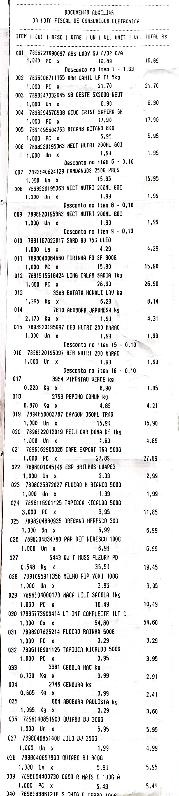

# Cupom Fiscal OCR

Projeto em Python para ler cupons fiscais de supermercado a partir de imagens, extrair os dados e transformá-los em um DataFrame para análise.

## Estrutura do Projeto

```
├── cupom_fiscal_ocr/
│   ├── __init__.py
│   ├── reader.py              # Função para processar a imagem com OCR
│   ├── parser.py              # Função para extrair os dados e transformar em dataframe
│   ├── utils.py               # Funções auxiliares (ex: limpeza de texto)
│   └── samples/
│   └── images/
│       └── imagens.jpg  # Exemplo de cupom fiscal (example_receipt)
│
├── tests/
│   ├── __init__.py
│   ├── test_reader.py
│   ├── test_parser.py
│
├── requirements.txt
├── README.md
└── main.py                    # Script principal para executar OCR e extrair dados
```
### 1. Clonar o repositório
```bash
git clone https://github.com/seu-usuario/cupom_fiscal_ocr.git
cd cupom_fiscal_ocr
```

### 2. Criar ambiente virtual e instalar dependências
```bash
python -m venv venv
source venv/bin/activate  # Linux/macOS
venv\Scripts\activate     # Windows

pip install -r requirements.txt
```

### 3. Executar o script principal
```bash
python main.py
```

## Funcionalidades

- Leitura de cupons fiscais por OCR com Tesseract.
- Extração de informações como itens, preços, totais e datas.
- Geração de DataFrame com os dados extraídos.

## Testes
```bash
pytest tests/
```

## Requisitos
- Python 3.8+
- Tesseract OCR (precisa estar instalado no sistema)

Para instalar o Tesseract:
- **Linux:** `sudo apt install tesseract-ocr`
- **macOS:** `brew install tesseract`
- **Windows:** Baixe e instale do [site oficial](https://github.com/tesseract-ocr/tesseract)

## Exemplo de Uso

```python
imagem = preprocessar_imagem("samples\images\example_receipt_9.jpg")
texto = ocr_linha_a_linha(imagem)
linhas = limpar_linhas(texto)
itens = parse_receipt_text_list_4(linhas)
df = pd.DataFrame(itens)
display(df)
```
### Exemplo de Cupom Fiscal



## *Considerações Finais*
Apesar dos esforços aplicados, o uso de expressões regulares `(re)` não se mostrou uma abordagem confiável nem viável para extrair padrões neste caso específico. Isso ocorre porque os dados apresentam muitas variações e inconsistências estruturais, tornando difícil criar regras genéricas que capturem os padrões desejados com precisão.

Diante disso, optamos por interromper o uso de expressões regulares como solução principal. Em vez disso, será conduzido um novo estudo com modelos treináveis — como algoritmos de machine learning ou regras baseadas em NLP (processamento de linguagem natural) — que possam aprender com os dados e aumentar significativamente a taxa de acerto.

Esse novo caminho busca:

Reduzir falsos positivos e negativos;

Tornar o processo mais robusto frente a novas entradas;

Automatizar com maior confiança a extração e padronização de informações.